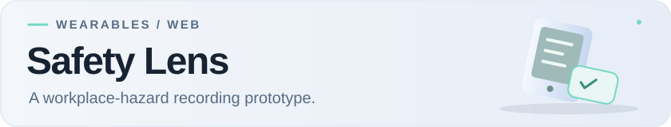

<a id="safety-lens"></a>
<picture>
  <source media="(prefers-color-scheme: dark)" srcset="docs/assets/readme/banner-dark.svg">
  
</picture>

I built this prototype to explore how smart glasses could help people record workplace hazards. The browser dashboard handles detailed records, while the glasses interface keeps the actions short: review a hazard, mark its status, or request a photo.

The app supports Korean and English, attendance records, hazards and photo evidence, local drafts, and printable reports.

<a id="interfaces"></a>
<details>
<summary>See the dashboard and glasses preview</summary>

**Browser dashboard**


**Glasses browser preview**


These use demo data. The glasses preview shows the browser interface, not a physical device.

</details>

<a id="system"></a>
## What changed while building it

My first idea was to put most of the workflow on the glasses. Working with the small display and limited inputs pushed me to move detailed editing into the dashboard instead.

The less visible parts became just as important. Offline changes need to survive a lost connection, and a local draft can't silently replace a record someone has also edited on the server. The app queues changes and asks for review when versions conflict.

I also kept attendance separate from acknowledgment, and an AI suggestion separate from a confirmed record. Those steps represent different things, even if combining them would make the interface simpler.

## Current limits

The AI suggestions are fixed mock responses; they don't analyze photos. Real glasses-camera capture requires a separate Android companion app, which isn't included here, and physical-device testing. The repository implements the server and web workflow for requesting and receiving that capture.

This remains a prototype, not a tool to rely on for workplace safety.

> [PLACEHOLDER — short screen recording showing a hazard added in the dashboard, reviewed in the glasses browser preview, and included in a report. Label the preview and any simulated inputs.]

**Built with:** TypeScript, Vite, Express, SQLite, and IndexedDB for local drafts.

<a id="start"></a>
## Run locally

<details>
<summary>Setup and run commands</summary>

Requires Node.js 24 or newer.

```bash
git clone https://github.com/loopedlol/MetaSafetyWebApp.git
cd MetaSafetyWebApp
npm ci
cp .env.example .env
npm run dev:all
```

On Windows, copy `.env.example` to `.env` using your shell or file manager.

Open `http://localhost:5173`. Register a local account using the registration key configured in `.env`. The glasses preview is at `http://localhost:5173/?mode=glasses`.

The example environment settings are for local development, not deployment. See the [configuration guide](docs/configuration.md) for the required settings.

To run the checks and build:

```bash
npm run check
```

</details>

<a id="docs"></a>
[Project reflection](docs/PROJECT_STORY.md) · [Code structure](docs/typescript-architecture.md) · [Glasses-camera setup and limits](docs/native-dat-capture.md) · [Security notes](SECURITY.md)
