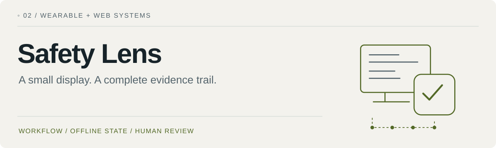
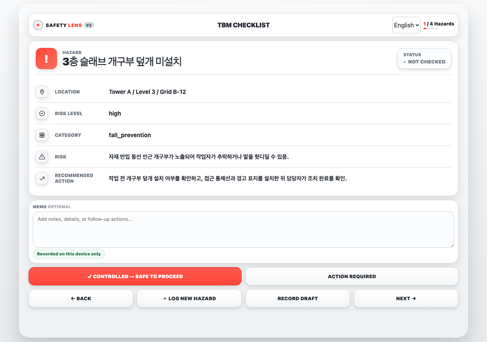
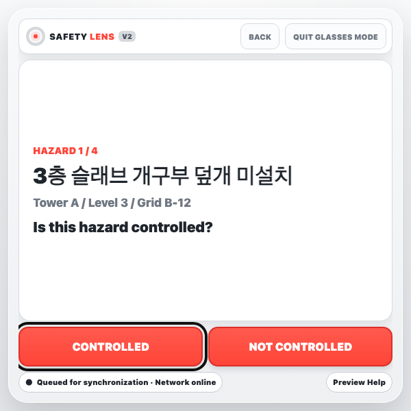
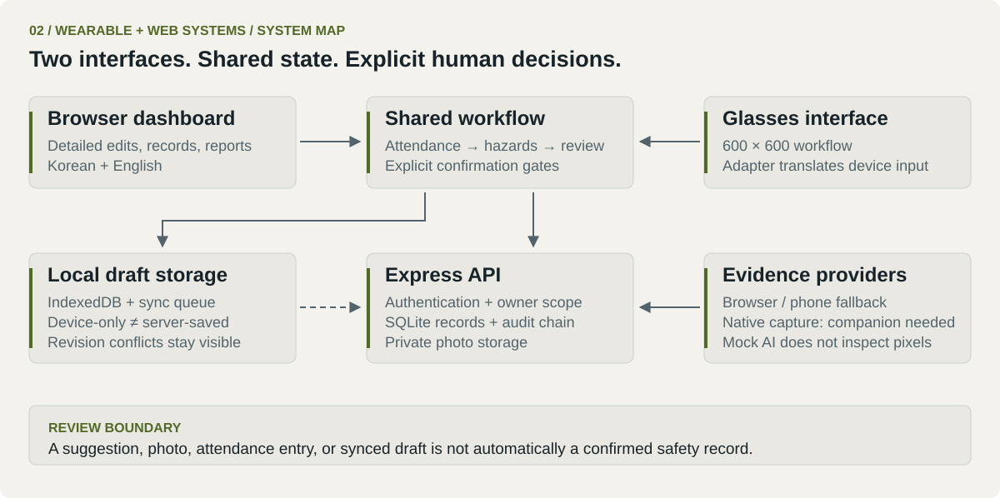

<picture>
  <source media="(prefers-color-scheme: dark)" srcset="docs/assets/portfolio/hero-dark.svg">
  
</picture>
[Colin's portfolio](https://github.com/loopedlol) · [Interfaces](#interfaces) · [System](#system) · [Run locally](#start) · [Documentation](#docs)

**Safety Lens** explores how a browser dashboard and a compact glasses interface can support the same toolbox-meeting (TBM) workflow: attendance, hazards, evidence, review, and a printable record.

<kbd>TypeScript</kbd> <kbd>Vite + Express</kbd> <kbd>SQLite</kbd> <kbd>IndexedDB</kbd> <kbd>Prototype</kbd>

The interesting constraint is deciding which actions belong on a small wearable display, which need a fuller interface, and which must remain an explicit human decision.

> **Prototype boundary:** this student/internship project is not a certified workplace-safety system. Built-in AI is a deterministic mock and does not interpret image pixels. Real glasses-camera capture depends on a separately configured companion and physical-device validation.

<a id="interfaces"></a>
## 01 / Two views of one workflow

**Browser dashboard** — detailed inputs, corrective actions, pairing, evidence management, saved sessions, and reports.



**Glasses preview** — a focused 600 × 600 review flow with a small action set.



Screenshots show the unchanged app running locally with demo data. The glasses image is a **browser preview**, not proof of a physical device session. [Capture details](docs/VISUALS.md).

<a id="system"></a>
## 02 / The boundaries are the design

<picture>
  <source media="(prefers-color-scheme: dark)" srcset="docs/assets/portfolio/system-dark.svg">
  
</picture>

| Boundary | Implemented behavior |
| --- | --- |
| Device capability | Browser and Meta Display adapters translate input into shared workflow actions. The Meta adapter does not claim direct web camera or voice capture. |
| Local / server state | IndexedDB drafts and a synchronization queue support interrupted connectivity. Revision conflicts need human resolution. |
| Evidence / decision | A captured or received photo must be explicitly attached. Mock AI suggestions require review before they affect records. |
| Attendance / acknowledgment | These are recorded as different facts. Attendance alone cannot establish acknowledgment. |
| Ownership | The Express backend controls access to sessions and private photo routes; SQLite stores records and a tamper-evident audit chain. |

The app is Korean by default and also provides an English interface. Native capture is an integration boundary documented in [the companion capture guide](docs/native-dat-capture.md); the Android companion implementation is not included in this repository.

<a id="start"></a>
## 03 / Run the prototype

Requires **Node.js 24+**, as declared in `package.json`.

```bash
git clone https://github.com/loopedlol/MetaSafetyWebApp.git
cd MetaSafetyWebApp
npm ci
cp .env.example .env
npm run dev:all
```

Open [localhost:5173](http://localhost:5173). Register a local account using the registration key configured in your local environment. The example values are development placeholders; the production configuration validator requires non-default secrets. [Configuration reference](docs/configuration.md).

| Interface | Local URL |
| --- | --- |
| Browser | `http://localhost:5173/` |
| Glasses preview | `http://localhost:5173/?mode=glasses` |
| Meta Display adapter | `http://localhost:5173/?mode=glasses&adapter=meta-display` |

The default backend port is `3001`. Opening the Meta adapter in a desktop browser does not create a hardware connection.

## 04 / Verification and limits

```bash
npm run check
npx playwright install chromium
npm run test:browser
```

`check` runs syntax/type checks, the Node tests, and a production build. Playwright covers the normal and glasses browser workflows using isolated test data.

Physical registration, permissions, camera capture, device revocation, and recovery still require the [physical-device checklist](docs/native-dat-capture.md#physical-device-checklist). Browser tests do not establish those properties on glasses. The current AI provider supports only mock mode; no real vision-analysis provider is configured.

The shared application workflow and server orchestration are large. Further decomposition, physical usability tests, and measured task-completion/error rates are useful future work. See [the original project reflection](docs/PROJECT_STORY.md) for the design lessons behind the system.

<a id="docs"></a>
## 05 / Go deeper

| Read about | Reference |
| --- | --- |
| Code boundaries | [TypeScript architecture](docs/typescript-architecture.md) |
| Environment and server settings | [Configuration](docs/configuration.md) |
| Persistence, recovery, and audit semantics | [Database](docs/database.md) |
| Companion-dependent capture | [Native DAT capture](docs/native-dat-capture.md) |
| Operating constraints | [Pilot operations](docs/pilot-operations.md) |
| Known security boundaries | [Pilot security review](docs/pilot-security-review.md) · [Security policy](SECURITY.md) |
| Korean / English behavior | [Localization](docs/localization.md) |
---

[← Portfolio](https://github.com/loopedlol) · [Related: sensing and control](https://github.com/loopedlol/CarVisionAI) · [Visual assets](docs/VISUALS.md)

<sub>Colin / loopedlol · Field Notes · 2026</sub>
